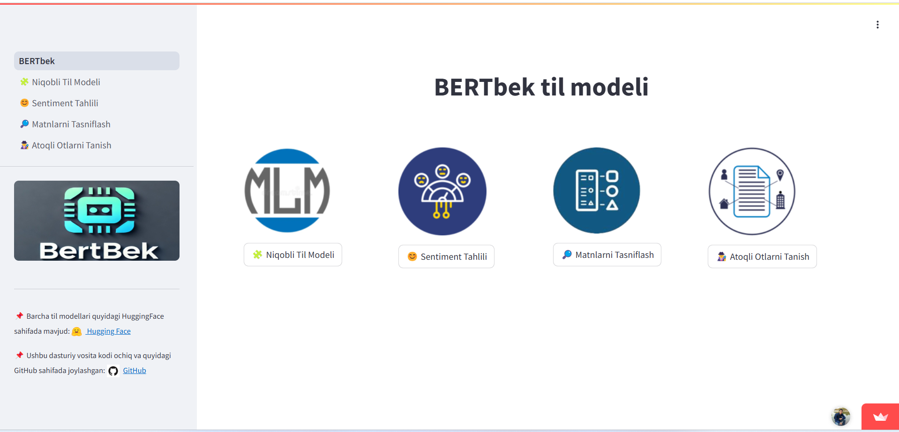

# 🇺🇿 BERTbek: Transformer-Based NLP Tools for Uzbek


A Streamlit web application demonstrating fine-tuned transformer models for **Uzbek language understanding tasks**, powered by `BERTbek`, a transformer-based language model developed for Uzbek.

🔗 **Live Demo**: [https://bertbek.streamlit.app](https://bertbek.streamlit.app)

---

## 🧠 Available NLP Tasks

This app showcases four practical NLP tasks, each powered by BERTbek and fine-tuned on Uzbek data:

| Task | Description |
|------|-------------|
| 🤖 **Masked Language Modeling (MLM)** | Predicts `[MASK]` tokens in a sentence. |
| 💬 **Sentiment Analysis** | Classifies sentiment as positive or negative. |
| 🔎 **Text Classification** | Detects article category from news content. |
| 🕵️ **Named Entity Recognition (NER)** | Identifies names, locations, dates, etc. in text. |

---


## 🔧 Technologies Used

- 🤗 [Transformers](https://huggingface.co/docs/transformers/index)
- 🎈 [Streamlit](https://streamlit.io/)
- 🐍 Python
- Plotly for visualizations
- Hugging Face Inference API

---

## 🤗 Models Used

| Task | Model |
|------|-------|
| MLM | [`bertbek-news-big-cased`](https://huggingface.co/elmurod1202/bertbek-news-big-cased) |
| Sentiment | [`bertbek-news-big-cased-sentiment-apps`](https://huggingface.co/elmurod1202/BERTbek-news-big-cased-sentiment-apps) |
| Text Classification | [`bertbek-news-classifier`](https://huggingface.co/elmurod1202/bertbek-news-classifier) |
| NER | [`bertbek-ner-uznews`](https://huggingface.co/elmurod1202/bertbek-ner-uznews) |

---

## 🚀 Run Locally

```bash
git clone https://github.com/elmurod1202/bertbek-nlp-app.git
cd bertbek-nlp-app
pip install -r requirements.txt
streamlit run BERTbek.py
